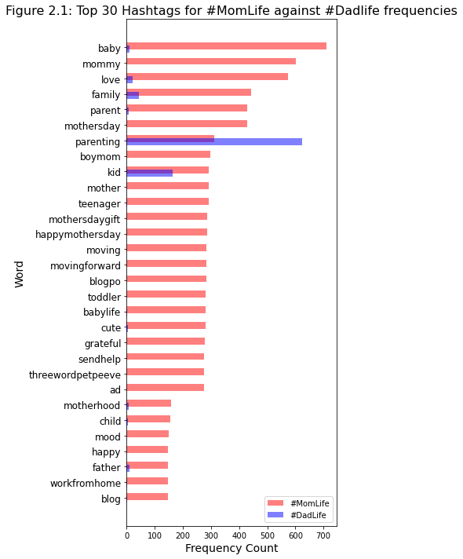
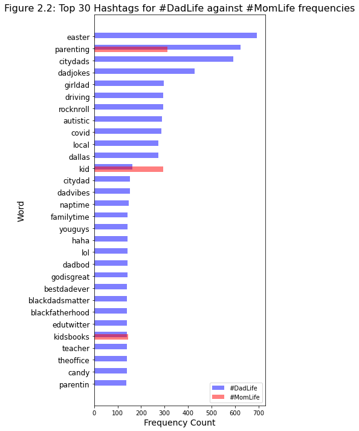
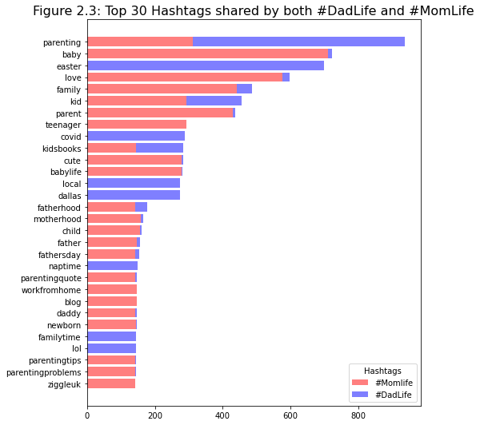

# replication-materials-borlasekn

[](https://doi.org/10.5281/zenodo.6569885)

The code and data in this repository is the research workflow for a MACS 30200 "Perspectives on Computational Research" final project at the University of Chicago. This project studied the performance of parenthood on Twitter to answer the question: To what extent does the expression of motherhood compare to that of fatherhood on Twitter?

The code is written in Python 3.9.7 and all of its dependencies can be installed by running the following in the terminal (with the requirements.txt file included in this repository):

```
pip install -r requirements.txt
```

Then, you can import the utils module located in the code folder of this repository to reproduce the analysis in the final report that this code supplements (in a Jupyter Notebook, like README.ipynb in this repository, or in any other Python script):

```
import sys
sys.path.insert(0, 'code')
import utils
import json
import pandas as pd
import matplotlib.pyplot as plt
```

## Part One: The Data

The data for our Tweets is composed of two dataframes stored in csv files located in the data folder of this repository. Per Twitter Develop API guidelines, the data here needs to be rehydrated using the Twitter Developer app, DocNow/Rehydrator. Detailed instructions can be found at this link: https://towardsdatascience.com/learn-how-to-easily-hydrate-tweets-a0f393ed340e

Once the data is preprocessed, it should be put into a dataframe with at least the following two columns: text and hashtags. The text column should contain the preprocessed text content from a Tweet. The hashtag column should contain all hashtags used in the Tweet. An example of how reading in these dataframes could work is below.

```
# read in data
dadlife = pd.read_csv("data/dadlife_df.csv", index_col=0)
momlife = pd.read_csv("data/momlife_df.csv", index_col=0)
```

## Part Two: The Analyses

### Analysis One: Frequency Analysis (Word and Hashtag Content)

#### Word Frequency Analysis. 

To prepare data for these analyses, run the code below.

```
from collections import Counter
import numpy as np
import matplotlib.pyplot as plt

ml_words = list(momlife['text'])
dl_words = list(dadlife['text'])
dl_words = " ".join(dl_words).split(" ")
ml_words = " ".join(ml_words).split(" ")

ml_topcounts = dict(Counter(ml_words).most_common(30))
dl_topcounts = dict(Counter(dl_words).most_common(30))

ml_counts = dict(Counter(ml_words))
dl_counts = dict(Counter(dl_words))

ml_toplabels, ml_topvalues = zip(*ml_topcounts.items())
dl_toplabels, dl_topvalues = zip(*dl_topcounts.items())

dl_values = []
for key in ml_topcounts:
    if key in dl_counts:
        dl_values.append(dl_counts[key])
    else:
        dl_values.append(0)
        
ml_values = []
for key in dl_topcounts:
    if key in ml_counts:
        ml_values.append(ml_counts[key])
    else:
        ml_values.append(0)
        
ml_values = [i for i in reversed(ml_values)]
dl_values = [i for i in reversed(dl_values)]
ml_toplabels = [i for i in reversed(ml_toplabels)]
dl_toplabels = [i for i in reversed(dl_toplabels)]
dl_topvalues = [i for i in reversed(dl_topvalues)]
ml_topvalues = [i for i in reversed(ml_topvalues)]
indexes = np.arange(len(ml_toplabels))
```

To plot these analyses on word count, run the code below.

Per the #Momlife plot below, there is the frequency of the top 30 words in #MomLife plotted with the frequency of those same words in #DadLife. The top words in #MomLife account for a variety of topics, including the identity as a mother, being busy, talking about their children, and talking about their values.

```
#Momlife plot
fig = plt.figure() 
fig.set_size_inches(6, 10)

plt.barh(indexes + 0.1, ml_topvalues, label = "#MomLife", color='r', alpha=0.5, height=0.45)
plt.barh(indexes - 0.1, dl_values, label = "#DadLife", color='b', alpha=0.5, height=0.45)

# add labels
plt.yticks(indexes, ml_toplabels, fontsize=12)
plt.xlabel('Frequency Count', fontsize=14)
plt.ylabel('Word', fontsize=14)
plt.title('Figure 1.1: Top 30 Words for #MomLife', fontsize=16, wrap=True)
plt.legend(loc='lower right')
fig.savefig('visuals/combinedml_frequency_barplot', bbox_inches='tight')
plt.show()
```


Per the #Dadlife plot below, there is the frequency of the top 30 words in #DadLife plotted with the frequency of those same words in #MomLife. The top words in #DadLife account for a more limited range of topics than momlife, but include spending time with their kids, their identity, and recreational activities.

```
#Dadlife plot
fig = plt.figure() 
fig.set_size_inches(6, 10)

plt.barh(indexes + 0.1, dl_topvalues, label = "#DadLife", color='b', alpha=0.5, height=0.45)
plt.barh(indexes - 0.1, ml_values, label = "#MomLife", color='r', alpha=0.5, height=0.45)

# add labels
plt.yticks(indexes, dl_toplabels, fontsize=12)
plt.xlabel('Frequency Count', fontsize=14)
plt.ylabel('Word', fontsize=14)
plt.title('Figure 1.2: Top 30 Words for #DadLife', fontsize=16)
plt.legend(loc='lower right')
fig.savefig('visuals/combineddl_frequency_barplot', bbox_inches='tight')
plt.show()
```


Finally, we combined our corpuses for a frequency analysis on the entire corpus of Tweets. To prepare and plot the data, run the code below.

Per the plot below, there is the top 30 most frequent words that occur in both #DadLife and #MomLife. The bars show how much the frequency comes from either of the hashtags. There are words about many of the roles that parents have, although some of these are fairly imbalanced with where their frequency comes from.

```
full_words_a = [i for i in dl_words if i in ml_words]
full_words_b = [i for i in ml_words if i in dl_words]

full_words = full_words_a + full_words_b
full_counts = dict(Counter(full_words).most_common(30))
full_labels, full_values = zip(*full_counts.items())
full_labels = [i for i in reversed(full_labels)]
full_values = [i for i in reversed(full_values)]
indexes = np.arange(len(full_labels))

ml_values = []
dl_values = []
for key in full_labels:
    if key in ml_counts:
        ml_values.append(ml_counts[key])
    else:
        ml_values.append(0)
        
    if key in dl_counts:
        dl_values.append(dl_counts[key])
    else:
        dl_values.append(0)


plt.rcParams["figure.figsize"] = [7.50, 7.50]
plt.rcParams["figure.autolayout"] = True

year = [2014, 2015, 2016, 2017, 2018, 2019]
issues_addressed = [10, 14, 0, 10, 15, 15]
issues_pending = [5, 10, 50, 2, 0, 10]


fig = plt.figure()
b1 = plt.barh(full_labels, ml_values, color="r", alpha=0.5)

b2 = plt.barh(full_labels, dl_values, left=ml_values, color="b", alpha=0.5)

plt.legend([b1, b2], ["#Momlife", "#DadLife"], title="Hashtags", loc="lower right")

plt.title('Figure 1.3: Top 30 Words shared by both #DadLife and #MomLife', fontsize=16, wrap=True)
fig.savefig('visuals/combined_frequency_barplot', bbox_inches='tight')
plt.show()
```


#### Hashtag Analysis

To prepare data for these analyses, run the code below.

```
ml_ht = list(momlife['hashtags'])
dl_ht = list(dadlife['hashtags'])
dl_ht = [i for i in dl_ht if isinstance(i, str)]
dl_ht = " ".join(dl_ht).split(" ")
dl_ht = [i for i in dl_ht if i]
ml_ht = [i for i in ml_ht if isinstance(i, str)]
ml_ht = " ".join(ml_ht).split(" ")

ml_counts = dict(Counter(ml_ht))
dl_counts = dict(Counter(dl_ht))

ml_topcounts = dict(Counter(ml_ht).most_common(30))
dl_topcounts = dict(Counter(dl_ht).most_common(30))
ml_toplabels, ml_topvalues = zip(*ml_topcounts.items())
dl_toplabels, dl_topvalues = zip(*dl_topcounts.items())

dl_values = []
for key in ml_topcounts:
    if key in dl_counts:
        dl_values.append(dl_counts[key])
    else:
        dl_values.append(0)

ml_values = []
for key in dl_topcounts:
    if key in ml_counts:
        ml_values.append(ml_counts[key])
    else:
        ml_values.append(0)

ml_values = [i for i in reversed(ml_values)]
dl_values = [i for i in reversed(dl_values)]
ml_toplabels = [i for i in reversed(ml_toplabels)]
dl_toplabels = [i for i in reversed(dl_toplabels)]
dl_topvalues = [i for i in reversed(dl_topvalues)]
ml_topvalues = [i for i in reversed(ml_topvalues)]
indexes = np.arange(len(ml_toplabels))
```

Then, to plot the barplots use the code that is below. 

Per the #Momlife plot below, there is the frequency of the top 30 hashtags in #MomLife plotted with the frequency of those same hashtags in #DadLife. The top words in #MomLife include topics such as being busy, needing help, indexing their identity as a mother, and being grateful. 

```
fig = plt.figure() 
fig.set_size_inches(6, 10)

plt.barh(indexes + 0.1, ml_topvalues, label = "#MomLife", color='r', alpha=0.5, height=0.45)
plt.barh(indexes - 0.1, dl_values, label = "#DadLife", color='b', alpha=0.5, height=0.45)

# add labels
plt.yticks(indexes, ml_toplabels, fontsize=12)
plt.xlabel('Frequency Count', fontsize=14)
plt.ylabel('Word', fontsize=14)
plt.title('Figure 2.1: Top 30 Hashtags for #MomLife against #Dadlife frequencies', fontsize=16)
plt.legend(loc="lower right")
fig.savefig('visuals/combinedml_htfrequency_barplot', bbox_inches='tight')
plt.show()
```



Per the #Dadlife plot below, there is the frequency of the top 30 hashtags in #DadLife plotted with the frequency of those same hashtags in #MomLife. The top words in #DadLife include topics such as their children, their identities, and occassions.

```
fig = plt.figure() 
fig.set_size_inches(6, 10)

plt.barh(indexes + 0.1, dl_topvalues, label = "#DadLife", color='b', alpha=0.5, height=0.45)
plt.barh(indexes - 0.1, ml_values, label = "#MomLife", color='r', alpha=0.5, height=0.45)

# add labels
plt.yticks(indexes, dl_toplabels, fontsize=12)
plt.xlabel('Frequency Count', fontsize=14)
plt.ylabel('Word', fontsize=14)
plt.title('Figure 2.2: Top 30 Hashtags for #DadLife against #MomLife frequencies', fontsize=16)
plt.legend(loc="lower right")
fig.savefig('visuals/combineddl_htfrequency_barplot', bbox_inches='tight')
plt.show()
```




Finally, we combined our corpuses for a frequency analysis on the entire hashtag corpus of Tweets. To prepare and plot the data, run the code below.

Per the plot below, there is the top 30 most frequent hashtags that occur in both #DadLife and #MomLife. The bars show how much the frequency comes from either of the hashtags. There are hashtags about many of the roles that parents have as well as their children and their identity. Most of these are not balanced, with the exception being "#kidsbooks" and "#parenting".

```
full_ht_a = [i for i in dl_ht if i in ml_ht]
full_ht_b = [i for i in ml_ht if i in dl_ht]

full_ht = full_ht_a + full_ht_b
full_counts = dict(Counter(full_ht).most_common(30))
full_labels, full_values = zip(*full_counts.items())
full_labels = [i for i in reversed(full_labels)]
full_values = [i for i in reversed(full_values)]
indexes = np.arange(len(full_labels))
ml_values = []
dl_values = []
for key in full_labels:
    if key in ml_counts:
        ml_values.append(ml_counts[key])
    else:
        ml_values.append(0)
        
    if key in dl_counts:
        dl_values.append(dl_counts[key])
    else:
        dl_values.append(0)

plt.rcParams["figure.figsize"] = [7.50, 7.50]
plt.rcParams["figure.autolayout"] = True

fig = plt.figure()
b1 = plt.barh(full_labels, ml_values, color="r", alpha=0.5)

b2 = plt.barh(full_labels, dl_values, left=ml_values, color="b", alpha=0.5)

plt.legend([b1, b2], ["#Momlife", "#DadLife"], title="Hashtags", loc="lower right")

plt.title('Figure 2.3: Top 30 Hashtags shared by both #DadLife and #MomLife', fontsize=16, wrap=True)
fig.savefig('visuals/combined_htfrequency_barplot', bbox_inches='tight')
plt.show()
```




### Analysis Two: Sentiment Analysis

Our Sentiment Analysis was divided into two parts. The first part involved using NLTK's Sentiment Intensity Analyzer. You can produce the plot below with the code below.

Per the plot below, we see that in general, #DadLife has higher sentiment scores than #MomLife.

```
sent_ml, sent_dl = utils.sentiment_comparison(momlife, dadlife)
fig = plt.figure() 
fig.set_size_inches(8, 6)
plt.hist(sent_dl, label='#DadLife Words', color='b', alpha=0.5)
plt.hist(sent_ml, label='#MomLife Words', color='r', alpha=0.5)
plt.title('Figure 3.1: Sentiment Analysis on Text Content in Tweets', 
              size = 16, y = 1.05)
plt.axvline(x = sent_dl.mean(), color='b', label='avg sentiment #DadLife')
plt.axvline(x = sent_ml.mean(), color='r', label='avg sentiment #MomLife')
plt.ylabel('Count', size = 14)
plt.xlabel('Sentiment Score', size = 14)
plt.legend(fontsize=12);
```


Because the second part of sentiment analysis is based on training a Deep Learning transformer, I've saved the sequence classifier scores in a json file in the data folder. To produce the plot we see below, run the code below.

This plot shows us that moms had higher anger and love in their Tweets while fathers had more joy. Fear and surprise were fairly balanced.

```
with open("data/emotions_dict.json", "r") as f:
    emotions = json.loads(f.read())

X = list(emotions['ml'].keys())
ml_emo = emotions['ml'].values()
dl_emo = emotions['dl'].values()
X_axis = np.arange(len(X))
plt.bar(X_axis - 0.2, ml_emo, 0.4, label = '#MomLife', color='r', alpha=0.5)
plt.bar(X_axis + 0.2, dl_emo, 0.4, label = '#DadLife', color='b', alpha=0.5)
plt.xticks(X_axis, X)
plt.xlabel("Emotions")
plt.ylabel("Sequence Classification Score (avg)")
plt.title("Figure 3.2: Average Sequence Classification Score for Tweet emotion")
plt.legend()
plt.show()
```


### Analysis Three: Topic Modeling

To run topic modeling and visualize the top keywords for each topic along with their weights, run the code below. In our plots, MomLife appears to have topics with the following themes: “activity”, “homemaking”, and “identity”. Dadlife, on the other hand, has topics of the following themes: "activity", "event", and "conversation". 

I established these looking at the keywords in the topics as well as examining tweets from each topic.

```
# MOMLIFE VISUALIZATION
# Creating figure
lda_model, doc_lda, corpus, id2word, texts = utils.lda_analysis(momlife, num_topics=3)
df_topic_sents_keywords = utils.format_topics_sentences(ldamodel=lda_model, corpus=corpus, texts=texts)
df_dominant_topic = utils.get_dominant_topic(df_topic_sents_keywords, lda_model, corpus)

# Momlife Topic Keywords
df = utils.get_topic_keywords(lda_model, texts)
# Plot Word Count and Weights of Topic Keywords
fig, axes = plt.subplots(1, 3, figsize=(22,12), sharey=False)
cols = [color for name, color in mcolors.TABLEAU_COLORS.items()]
for i, ax in enumerate(axes.flatten()):
    if i == 3:
        break
    ax.barh(y='word', width="word_count", data=df.loc[df.topic_id==i, :], color=cols[i], height=0.5, alpha=0.3, label='Word Count')
    ax_twin = ax.twiny()
    ax_twin.barh(y='word', width="importance", data=df.loc[df.topic_id==i, :], color=cols[i], height=0.2, label='Weights')
    #ax.set_ylabel('Word', fontsize=16)
    ax_twin.set_xlim(0, 0.050); ax.set_xlim(0, 3500)
    ax.set_title('Topic: ' + str(i), color=cols[i], fontsize=16)
    ax.tick_params(axis='x', left=False)
    ax.set_yticklabels(df.loc[df.topic_id==i, 'word'], fontsize=16)
    ax.legend(loc='lower right', fontsize=14); ax_twin.legend(loc='upper right', fontsize=14);

fig.tight_layout(w_pad=2)
fig.suptitle('Figure 4.3: Wordcount and Importance in #MomLife Topic Keywords', fontsize=22, y=1.03)    
plt.show();
```


```
lda_model, doc_lda, corpus, id2word, texts = utils.lda_analysis(dadlife, num_topics=3)
df_topic_sents_keywords = utils.format_topics_sentences(ldamodel=lda_model, corpus=corpus, texts=texts)
df_dominant_topic = utils.get_dominant_topic(df_topic_sents_keywords, lda_model, corpus)

# Dadlife Topic Keywords
df = utils.get_topic_keywords(lda_model, texts)
# Plot Word Count and Weights of Topic Keywords
fig, axes = plt.subplots(1, 3, figsize=(22,12), sharey=False)
cols = [color for name, color in mcolors.TABLEAU_COLORS.items()]
for i, ax in enumerate(axes.flatten()):
    if i == 3:
        break
    ax.barh(y='word', width="word_count", data=df.loc[df.topic_id==i, :], color=cols[i], height=0.5, alpha=0.3, label='Word Count')
    ax_twin = ax.twiny()
    ax_twin.barh(y='word', width="importance", data=df.loc[df.topic_id==i, :], color=cols[i], height=0.2, label='Weights')
    #ax.set_ylabel('Word', fontsize=16)
    ax_twin.set_xlim(0, 0.050); ax.set_xlim(0, 3500)
    ax.set_title('Topic: ' + str(i), color=cols[i], fontsize=16)
    ax.tick_params(axis='x', left=False)
    ax.set_yticklabels(df.loc[df.topic_id==i, 'word'], fontsize=16)
    ax.legend(loc='lower right', fontsize=14); ax_twin.legend(loc='upper right', fontsize=14);

fig.tight_layout(w_pad=2)
fig.suptitle('Figure 4.4: Wordcount and Importance in #DadLife Topic Keywords', fontsize=22, y=1.03)    
plt.show();
```


If you use this repository for a scientific publication, we would appreciate it if you cited the Zenodo DOI (see the "Cite as" section on our Zenodo page for more details).
