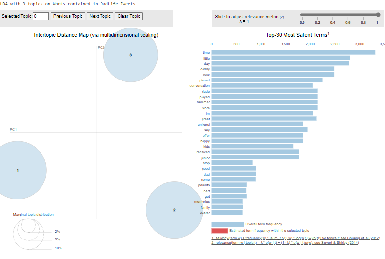
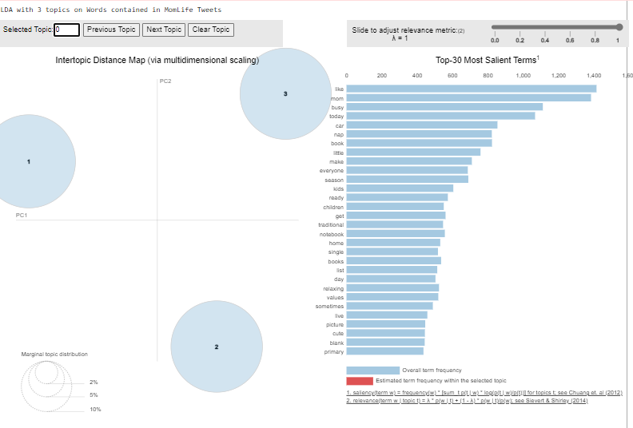

# replication-materials-borlasekn

The code and data in this repository is the research workflow for a MACS 30200 "Perspectives on Computational Research" final project at the University of Chicago. This project studied the performance of parenthood on Twitter to answer the question: To what extent does the expression of
motherhood compare to that of fatherhood on Twitter?

The code is written in Python 3.9.7 and all of its dependencies can be installed by running the following in the terminal (with the requirements.txt file included in this repository):

```
pip install -r requirements.txt
```

Then, you can import the utils module located in the code folder of this repository to reproduce the analysis in the final report that this code supplements (in a Jupyter Notebook, like README.ipynb in this repository, or in any other Python script):

```
# import statements
import sys
sys.path.insert(0, 'code')
import utils
```

### Part One: The Data

The first part of our data for our Tweets is composed of two dictionaries stored in json files. located in the data folder of this repository. The dictionaries are in this repositories "data" folder. You can read them in with the following code:

```
# read in data
with open('data/dadlife.json', encoding='utf-8') as F:
    dadlife = json.loads(F.read())
with open('data/momlife.json', encoding='utf-8') as F:
    momlife = json.loads(F.read())
```

### Part Two: Topic Modeling with LDA

You can then use the lda_analysis function in the analysis module to run Topic Modeling with LDA. The code underneath the functions here can then be run to produce the plots found in the (future) final report.

Per the two plots below, we have three topics for each parental role, and we get the following topics for each:

* DadLife: The topics here seem to be about experiences with their kids/family (time, memories, easter, nerf, outdoors, etc).
* MomLife: The topics here seem to be about more aspects of parenting (naps, babies, books, crazy, outing, picture, peaceful, grocery, etc.)

These findings are relevant to answer our research question because we can see differences in the ways that mothers and fathers might express or perform their parental duties online. Further in our research, as we tune parameters to get the best number of topics and determine categories of these topics, we will be able to see, in general, what women "perform" about motherhood versus what men "perform" about fatherhood. We are beginning to see differences here that could connect back to theory, and I anticipate that these will be continued as I look at more aspects of the Tweets.

```
# visualize dadlife
lda_model, doc_lda, corpus, id2word = utils.lda_analysis(dadlife, num_topics=3)
pyLDAvis.enable_notebook()
LDAvis_data_filepath = ('visuals/ldavis_prepared_dadlife_3topics')
LDAvis_prepared = pyLDAvis.gensim_models.prepare(lda_model, corpus, id2word)
with open(LDAvis_data_filepath, 'wb') as f:
    pickle.dump(LDAvis_prepared, f)
with open(LDAvis_data_filepath, 'rb') as f:
    LDAvis_prepared = pickle.load(f)
print("LDA with 3 topics on Words contained in DadLife Tweets")
LDAvis_prepared
```



```
# visualize momlife
lda_model, doc_lda, corpus, id2word = utils.lda_analysis(momlife, num_topics=3)
pyLDAvis.enable_notebook()
LDAvis_data_filepath = ('visuals/ldavis_prepared_momlife_3topics')
LDAvis_prepared = pyLDAvis.gensim_models.prepare(lda_model, corpus, id2word)
with open(LDAvis_data_filepath, 'wb') as f:
    pickle.dump(LDAvis_prepared, f)
with open(LDAvis_data_filepath, 'rb') as f:
    LDAvis_prepared = pickle.load(f)
print("LDA with 3 topics on Words contained in MomLife Tweets")
LDAvis_prepared
```



### Part Three: Other hashtags

To be continued...

### Part Three: Timestamps on Tweets

To be continued...

If you use this repository for a scientific publication, we would appreciate it if you cited the the MIT license found under the LICENSE file of this repository.

I have not made this repository public, as this may be a pilot study for my Master's thesis.
