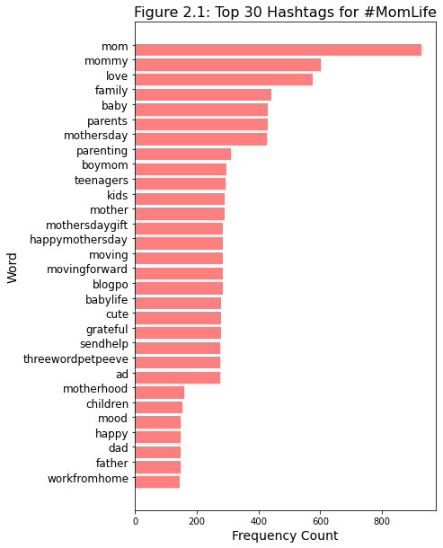
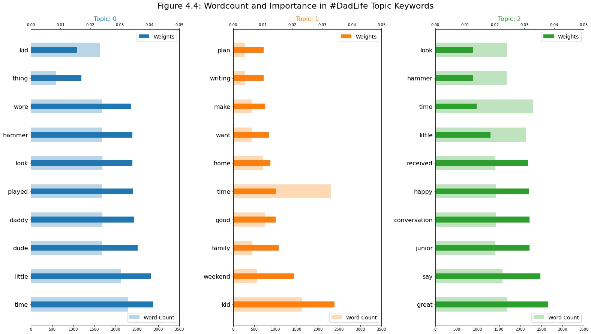

# replication-materials-borlasekn

The code and data in this repository is the research workflow for a MACS 30200 "Perspectives on Computational Research" final project at the University of Chicago. This project studied the performance of parenthood on Twitter to answer the question: To what extent does the expression of motherhood compare to that of fatherhood on Twitter?

The code is written in Python 3.9.7 and all of its dependencies can be installed by running the following in the terminal (with the requirements.txt file included in this repository):

```
pip install -r requirements.txt
```

Then, you can import the utils module located in the code folder of this repository to reproduce the analysis in the final report that this code supplements (in a Jupyter Notebook, like README.ipynb in this repository, or in any other Python script):

```
import sys
sys.path.insert(0, 'code')
import utils
import json
import pandas as pd
import matplotlib.pyplot as plt
```

## Part One: The Data

The data for our Tweets is composed of two dataframes stored in csv files. located in the data folder of this repository. You can read in the dataframes in with the following code:

```
# read in data
dadlife = pd.read_csv("data/dadlife_df.csv", index_col=0)
momlife = pd.read_csv("data/momlife_df.csv", index_col=0)
```

## Part Two: The Analyses

### Analysis One: Frequency Analysis (Word and Hashtag Content)

Word Frequency Analysis

```
# MomLife
indexes, values, labels = utils.word_frequency(momlife)

bar_width = 0.35

fig = plt.figure() 
fig.set_size_inches(6, 10)

plt.barh(indexes, values, color='r', alpha=0.5)

# add labels
plt.yticks(indexes + bar_width, labels, fontsize=12)
plt.xlabel('Frequency Count', fontsize=14)
plt.ylabel('Word', fontsize=14)
plt.title('Figure 1.1: Top 30 Words for #MomLife', fontsize=16)
plt.show()
```


```
# DadLife
indexes, values, labels = utils.word_frequency(dadlife)

bar_width = 0.35

fig = plt.figure() 
fig.set_size_inches(6, 10)

plt.barh(indexes, values, color='r', alpha=0.5)

# add labels
plt.yticks(indexes + bar_width, labels, fontsize=12)
plt.xlabel('Frequency Count', fontsize=14)
plt.ylabel('Word', fontsize=14)
plt.title('Figure 1.2: Top 30 Words for #DadLife', fontsize=16)
plt.show()
```


Hashtag Analysis

```
#MomLife
indexes, values, labels = utils.get_frequent_hashtags(momlife)

bar_width = 0.35
fig = plt.figure() 
fig.set_size_inches(6, 10)
plt.barh(indexes, values, color='b', alpha=0.5)
# add labels
plt.yticks(indexes + bar_width, labels, fontsize=12)
plt.xlabel('Frequency Count', fontsize=14)
plt.ylabel('Word', fontsize=14)
plt.title('Figure 2.1: Top 30 Hashtags for #MomLife', fontsize=16)
plt.show()
```



```
#DadLife
indexes, values, labels = utils.get_frequent_hashtags(dadlife)

bar_width = 0.35
fig = plt.figure() 
fig.set_size_inches(6, 10)
plt.barh(indexes, values, color='b', alpha=0.5)
# add labels
plt.yticks(indexes + bar_width, labels, fontsize=12)
plt.xlabel('Frequency Count', fontsize=14)
plt.ylabel('Word', fontsize=14)
plt.title('Figure 2.2: Top 30 Hashtags for #DadLife', fontsize=16)
#fig.savefig('visuals/Dadlife_htfrequency_barplot', bbox_inches='tight')
plt.show()
```


### Analysis Two: Sentiment Analysis

Our Sentiment Analysis was divided into two parts. The first part involved using NLTK's Sentiment Intensity Analyzer. You can produce the plot below with the code below.

Per the plot below, we see that in general, #DadLife has higher sentiment scores than #MomLife.

```
sent_ml, sent_dl = utils.sentiment_comparison(momlife, dadlife)
fig = plt.figure() 
fig.set_size_inches(8, 6)
plt.hist(sent_dl, label='#DadLife Words', color='b', alpha=0.5)
plt.hist(sent_ml, label='#MomLife Words', color='r', alpha=0.5)
plt.title('Figure 3.1: Sentiment Analysis on Text Content in Tweets', 
              size = 16, y = 1.05)
plt.axvline(x = sent_dl.mean(), color='b', label='avg sentiment #DadLife')
plt.axvline(x = sent_ml.mean(), color='r', label='avg sentiment #MomLife')
plt.ylabel('Count', size = 14)
plt.xlabel('Sentiment Score', size = 14)
plt.legend(fontsize=12);
```


Because the second part of sentiment analysis is based on training a Deep Learning transformer, I've saved the sequence classifier scores in a json file in the data folder. To produce the plot we see below, run the following code:

```
with open("data/emotions_dict.json", "r") as f:
    emotions = json.loads(f.read())

X = list(emotions['ml'].keys())
ml_emo = emotions['ml'].values()
dl_emo = emotions['dl'].values()
X_axis = np.arange(len(X))
plt.bar(X_axis - 0.2, ml_emo, 0.4, label = '#MomLife', color='r', alpha=0.5)
plt.bar(X_axis + 0.2, dl_emo, 0.4, label = '#DadLife', color='b', alpha=0.5)
plt.xticks(X_axis, X)
plt.xlabel("Emotions")
plt.ylabel("Sequence Classification Score (avg)")
plt.title("Figure 3.2: Average Sequence Classification Score for Tweet emotion")
plt.legend()
plt.show()
```


### Analysis Three: Topic Modeling

```
# MOMLIFE VISUALIZATION
# Creating figure
lda_model, doc_lda, corpus, id2word, texts = utils.lda_analysis(momlife, num_topics=3)
df_topic_sents_keywords = utils.format_topics_sentences(ldamodel=lda_model, corpus=corpus, texts=texts)
df_dominant_topic = utils.get_dominant_topic(df_topic_sents_keywords, lda_model, corpus)
# Creating figure
fig = plt.figure(figsize = (10, 10))
ax = plt.axes(projection ="3d")
x = np.array(df_dominant_topic['T0 Coords'])
y = np.array(df_dominant_topic['T1 Coords'])
z = np.array(df_dominant_topic['T2 Coords'])
group = np.array(df_dominant_topic['Dominant_Topic'])
labels = ['0', '1', '2']
scatter = ax.scatter3D(x, y, z, c=group, depthshade=True)
#ax.ylabel("")
ax.set_title("Figure 4.1: Topic Percentage Contribution for #MomLife Tweets", size=18)
ax.set_xlabel("Topic 0 Contribution")
ax.set_ylabel("Topic 1 Contribution")
ax.set_zlabel("Topic 2 Contribution")
ax.view_init(-140, 60)
ax.legend(handles=scatter.legend_elements()[0], labels=labels, title="Topic")
plt.show()
```


```
# DADLIFE VISUALIZATION
# Creating figure
lda_model, doc_lda, corpus, id2word, texts = utils.lda_analysis(dadlife, num_topics=3)
df_topic_sents_keywords = utils.format_topics_sentences(ldamodel=lda_model, corpus=corpus, texts=texts)
df_dominant_topic = utils.get_dominant_topic(df_topic_sents_keywords, lda_model, corpus)
# Creating figure
fig = plt.figure(figsize = (10, 10))
ax = plt.axes(projection ="3d")
x = np.array(df_dominant_topic['T0 Coords'])
y = np.array(df_dominant_topic['T1 Coords'])
z = np.array(df_dominant_topic['T2 Coords'])
group = np.array(df_dominant_topic['Dominant_Topic'])
labels = ['0', '1', '2']
scatter = ax.scatter3D(x, y, z, c=group, depthshade=True)
#ax.ylabel("")
ax.set_title("Figure 4.2: Topic Percentage Contribution for #DadLife Tweets", size=18)
ax.set_xlabel("Topic 0 Contribution")
ax.set_ylabel("Topic 1 Contribution")
ax.set_zlabel("Topic 2 Contribution")
ax.view_init(-140, 60)
ax.legend(handles=scatter.legend_elements()[0], labels=labels, title="Topic")
plt.show()
```


```
# Momlife Topic Keywords
df = utils.get_topic_keywords(lda_model, texts)
# Plot Word Count and Weights of Topic Keywords
fig, axes = plt.subplots(1, 3, figsize=(22,12), sharey=False)
cols = [color for name, color in mcolors.TABLEAU_COLORS.items()]
for i, ax in enumerate(axes.flatten()):
    if i == 3:
        break
    ax.barh(y='word', width="word_count", data=df.loc[df.topic_id==i, :], color=cols[i], height=0.5, alpha=0.3, label='Word Count')
    ax_twin = ax.twiny()
    ax_twin.barh(y='word', width="importance", data=df.loc[df.topic_id==i, :], color=cols[i], height=0.2, label='Weights')
    #ax.set_ylabel('Word', fontsize=16)
    ax_twin.set_xlim(0, 0.050); ax.set_xlim(0, 3500)
    ax.set_title('Topic: ' + str(i), color=cols[i], fontsize=16)
    ax.tick_params(axis='x', left=False)
    ax.set_yticklabels(df.loc[df.topic_id==i, 'word'], fontsize=16)
    ax.legend(loc='lower right', fontsize=14); ax_twin.legend(loc='upper right', fontsize=14);

fig.tight_layout(w_pad=2)
fig.suptitle('Figure 4.3: Wordcount and Importance in #MomLife Topic Keywords', fontsize=22, y=1.03)    
plt.show();
```


```
# Dadlife Topic Keywords
df = utils.get_topic_keywords(lda_model, texts)
# Plot Word Count and Weights of Topic Keywords
fig, axes = plt.subplots(1, 3, figsize=(22,12), sharey=False)
cols = [color for name, color in mcolors.TABLEAU_COLORS.items()]
for i, ax in enumerate(axes.flatten()):
    if i == 3:
        break
    ax.barh(y='word', width="word_count", data=df.loc[df.topic_id==i, :], color=cols[i], height=0.5, alpha=0.3, label='Word Count')
    ax_twin = ax.twiny()
    ax_twin.barh(y='word', width="importance", data=df.loc[df.topic_id==i, :], color=cols[i], height=0.2, label='Weights')
    #ax.set_ylabel('Word', fontsize=16)
    ax_twin.set_xlim(0, 0.050); ax.set_xlim(0, 3500)
    ax.set_title('Topic: ' + str(i), color=cols[i], fontsize=16)
    ax.tick_params(axis='x', left=False)
    ax.set_yticklabels(df.loc[df.topic_id==i, 'word'], fontsize=16)
    ax.legend(loc='lower right', fontsize=14); ax_twin.legend(loc='upper right', fontsize=14);

fig.tight_layout(w_pad=2)
fig.suptitle('Figure 4.4: Wordcount and Importance in #DadLife Topic Keywords', fontsize=22, y=1.03)    
plt.show();
```




If you use this repository for a scientific publication, we would appreciate it if you cited the the MIT license found under the LICENSE file of this repository.

I have not made this repository public, as this may be a pilot study for my Master's thesis.
